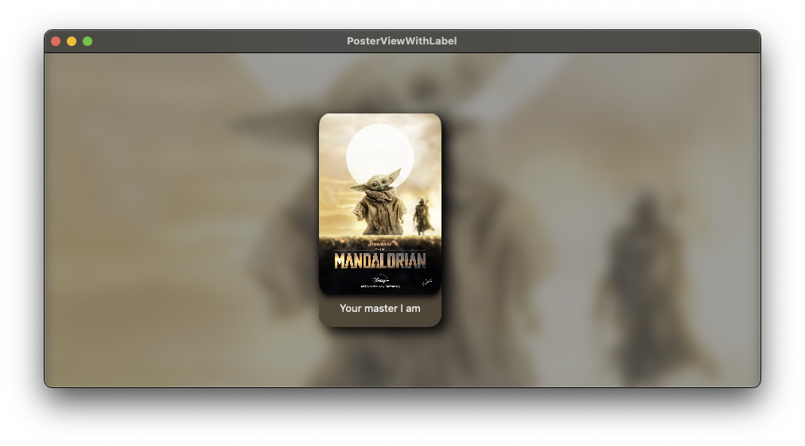
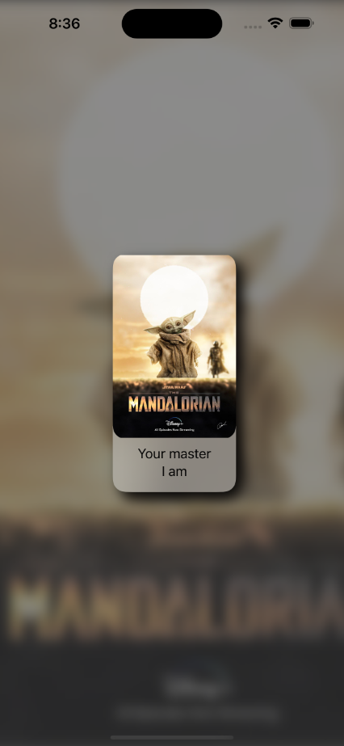

# Poster View, with label, in SwiftUI

An experimentation in overlapping views to produce a "connected" view.  The intention is to have the "label" appear "connected" to the poster view in some way without having the text actually overlap the poster view itself.

<table>
  <tr valign="top">
    <td></td>
    <td></td>
  </tr>
</table>
